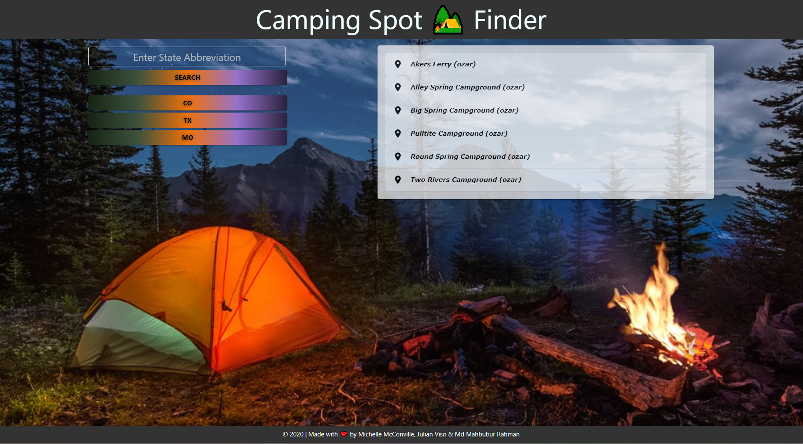

# Camping Spot Finder

## Link to deployed application

https://michellemcconville.github.io/P1-camping-spot-finder/ 

## Description

Campers are often looking for an application where they can find as many details about their camping trip and where they can make decisions based on that campsite. We built an application that will run in the browser and features dynamically updated HTML and Materilize CSS framework.

## Technology Used
    Html
    CSS
    JavaScript
    Materilize.js
    Server side API


## User Story

```
AS an avid camper
I WANT to see a responsive camp planning tool
SO THAT I can plan a camping trip with as much as details as possible
```

## Acceptance Criteria

```
GIVEN a state abbreviation with form inputs
WHEN I search for a state
THEN I am presented with listed camping spot with total camp sites, cost, website, contact email, contact phone number, operating hours as well as map if it is available

```

## Mock-Up

The following image demonstrates the application functionality:




